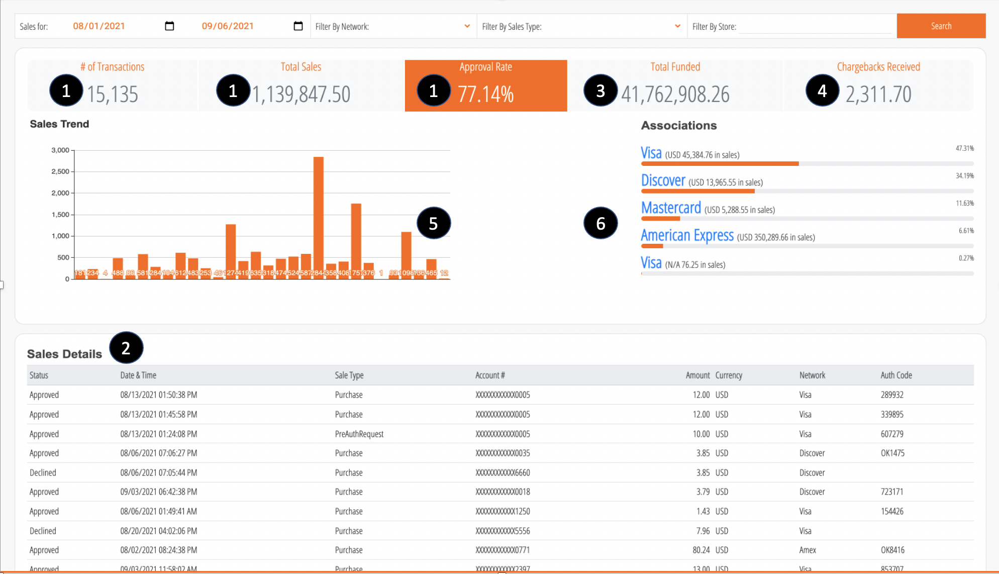

# Merchant Reporting Portal

You can build your own integrated merchant portal experience utilizing the APIs available here. Whether it is for a responsive web application or a native mobile application, all the APIs needed to build thee experience are available.
 
Here is a sample Merchant Dashboard we created to show case the APIs. Click here (coming soon) on your favorite browser to see the dashboard live in-action and trace the exact API calls invoked. 




#### .png)  Number of Transactions,Total Sales,Approval Rat

<!-- theme: success -->
>**POST** `/v1/authorization/summary`

##### Payload

<!--
type: tab
title: Request
-->

```json
curl -X 'POST' \
  'http://localhost:5005/v1/authorization/summary' \
  -H 'accept: application/json' \
  -H 'apiKey: YOUR KEY' \
  -H 'Content-Type: application/json' \
  -d '{
  "fromDate": "20210801",
  "toDate": "20210906"
}'
```

<!--
type: tab
title: Response
-->

##### Successful response (200)

```json
[
  {
    "currency": "CAD",
    "countTotal": 5678,
    "amountTotal": 24665.82,
    "approvedCount": 5000
  },
  {
    "currency": "N/A",
    "countTotal": 5457,
    "amountTotal": 369636.79000000004,
    "approvedCount": 3000
  },
  {
    "currency": "USD",
    "countTotal": 4000,
    "amountTotal": 745544.89,
    "approvedCount": 3675
  }
]
```

#### (2) Sales Details

<!-- theme: success -->
>**POST** `/v1/authorization/search`

##### Payload

<!--
type: tab
title: Request
-->

```json
curl -X 'POST' \
  'http://localhost:5005/v1/authorization/search' \
  -H 'accept: application/json' \
  -H 'apiKey: YOUR KEY' \
  -H 'Content-Type: application/json' \
  -d '{
  "fromDate": "20210801",
  "toDate": "20210906",
  "limit":2,
  "fields":["ApprovalCode","TransactionDateTime","Type","AccountNumber","Currency","Network","AuthCode","Amount"]
}'
```

<!--
type: tab
title: Response
-->

##### Successful response (200)

```json
[
  {
        "approvalCode": "Declined",
        "amount": 12.0,
        "authCode": 289932,
        "transactionDateTime": "08/13/2021 08:26:10 AM",
        "currency": "USD",
        "type": "PreAuthRequest",
        "accountNumber": "XXXXXXXXXXXX6660",
        "network": "Discover"
    },
    {
        "approvalCode": "Approved",
        "amount": 10.0,
        "authCode": "607279",
        "transactionDateTime": "08/13/2021 08:25:50 AM",
        "currency": "USD",
        "type": "Purchase",
        "accountNumber": "XXXXXXXXXXXX0018",
        "network": "Visa"
    }
]
```

#### (3) Total Funded

<!-- theme: success -->
>**POST** `/v1/funding/summary`

##### Payload

<!--
type: tab
title: Request
-->

```json
curl -X 'POST' \
  'http://localhost:5005/v1/funding/summary' \
  -H 'accept: application/json' \
  -H 'apiKey: YOUR KEY' \
  -H 'Content-Type: application/json' \
  -d '{
  "fromDate": "20210801",
  "toDate": "20210906",
  "summaryBy": "ProductCode"
}'
```

<!--
type: tab
title: Response
-->

##### Successful response (200)

```json
[
  {
    "currency": "USD",
    "value": "MASTERCARD",
    "processedNetSales": 11267048.91,
    "processedPaidByOthers": 0,
    "processedAdjustments": 0,
    "processedICCharges": -410.19,
    "processedServiceCharges": -21.84,
    "processedFees": -67.18,
    "processedChargebacksReversals": -531.82,
    "processedDeposit": 11266017.88,
    "processedAmountPaid": 11266017.88
  },
  {
    "currency": "USD",
    "value": "VISA",
    "processedNetSales": 29368092.33,
    "processedPaidByOthers": 0,
    "processedAdjustments": 0,
    "processedICCharges": -470.5,
    "processedServiceCharges": -18.11,
    "processedFees": -49.1,
    "processedChargebacksReversals": -1456.12,
    "processedDeposit": 29366098.5,
    "processedAmountPaid": 29366098.5
  }
]
```

#### (4) Chargebacks Received

<!-- theme: success -->
>**POST** `/v1/chargeback/summary`

##### Payload

<!--
type: tab
title: Request
-->

```json
curl -X 'POST' \
  'http://localhost:5005/v1/chargeback/summary' \
  -H 'accept: application/json' \
  -H 'apiKey: YOUR KEY' \
  -H 'Content-Type: application/json' \
  -d '{
  "fromDate": "20210801",
  "toDate": "20210906",
  "summaryBy": "Category"
}'
```

<!--
type: tab
title: Response
-->

##### Successful response (200)

```json
[
  {
    "currency": "USD",
    "value": "Debited",
    "countTotal": 125,
    "chargebackAmountTotal": 2311.7,
    "adjustmentAmountTotal": -1530.25
  }
]
```

#### (5) Sales Trend [TBD]

#### (6) Associations

<!-- theme: success -->
>**POST** `/v1/authorization/summary`

##### Payload

<!--
type: tab
title: Request
-->

```json
curl -X 'POST' \
  'http://localhost:5005/v1/authorization/summary' \
  -H 'accept: application/json' \
  -H 'apiKey: YOUR KEY' \
  -H 'Content-Type: application/json' \
  -d '{
  "fromDate": "20210801",
  "toDate": "20210906",
  "summaryBy": "Network"
}'
```

<!--
type: tab
title: Response
-->

##### Successful response (200)

```json
[
  {
    "currency": "USD",
    "value": "American Express",
    "countTotal": 124,
    "amountTotal": 350289.66,
    "approvedCount": 119
  },
  {
    "currency": "USD",
    "value": "Visa",
    "countTotal": 887,
    "amountTotal": 45384.76,
    "approvedCount": 851
  },
  {
    "currency": "USD",
    "value": "Mastercard",
    "countTotal": 218,
    "amountTotal": 5288.55,
    "approvedCount": 217
  }
]
```