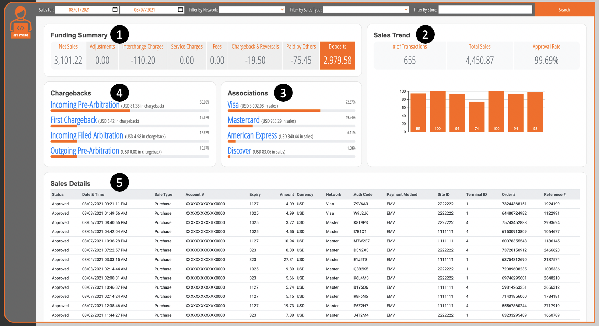

# Merchant Reporting Portal

You can build your own integrated merchant portal experience utilizing the APIs available here. Whether it is for a responsive web application or a native mobile application, all the APIs needed to build thee experience are available.
 
Here is a sample Merchant Dashboard we created to show case the APIs. Click here (coming soon) on your favorite browser to see the dashboard live in-action and trace the exact API calls invoked. 




#### .png)  Funding Summary

Funding summary pulled for the dates specified for the 2 stores. There are many other summary options available, this specific example is pulling the overall summary. Check out the Funding summary API for these options.


<!-- theme: success -->
>**POST** `/v1/funding/summary`

##### Payload

<!--
type: tab
title: Request
-->

```json
curl -X 'POST' \
  'http://localhost:5005/v1/funding/summary' \
  -H 'accept: application/json' \
  -H 'apiKey: YOUR KEY' \
  -H 'Content-Type: application/json' \
  -d '{
        "fromDate": "20210801",
        "toDate": "20210807"
      }'
```

<!--
type: tab
title: Response
-->

##### Successful response (200)

```json
[
  {
    "currency": "USD",
    "processedNetSales": 3101.22,
    "processedPaidByOthers": -75.45,
    "processedAdjustments": 0,
    "processedICCharges": -110.1983,
    "processedServiceCharges": 0,
    "processedFees": 0,
    "processedChargebacksReversals": -19.5,
    "processedDeposit": 2979.581,
    "processedAmountPaid": 2979.581
  }
]

```

#### .jpg) Sales Trend

Sales (via Authorizations) trend pulled for the specified dates for the 2 stores

<!-- theme: success -->
>**POST** `/v1/authorization/summary`

##### Payload

<!--
type: tab
title: Request
-->

```json
curl -X 'POST' \
  'http://localhost:5005/v1/authorization/summary' \
  -H 'accept: application/json' \
  -H 'apiKey: YOUR KEY' \
  -H 'Content-Type: application/json' \
  -d '{
        "fromDate": "20210801",
        "toDate": "20210807",
        "summaryBy": "TxnDay",
        "filters": {}
      }'
```

<!--
type: tab
title: Response
-->

##### Successful response (200)

```json
[
  {
    "currency": "USD",
    "value": "20210802",
    "countTotal": 95,
    "amountTotal": 572.1,
    "approvedCount": 95
  },
  {
    "currency": "USD",
    "value": "20210801",
    "countTotal": 100,
    "amountTotal": 744.82,
    "approvedCount": 99
  },
  {
    "currency": "USD",
    "value": "20210804",
    "countTotal": 94,
    "amountTotal": 587.87,
    "approvedCount": 94
  },
  {
    "currency": "USD",
    "value": "20210803",
    "countTotal": 74,
    "amountTotal": 409.92,
    "approvedCount": 73
  },
  {
    "currency": "USD",
    "value": "20210806",
    "countTotal": 100,
    "amountTotal": 840.03,
    "approvedCount": 100
  },
  {
    "currency": "USD",
    "value": "20210805",
    "countTotal": 94,
    "amountTotal": 799.52,
    "approvedCount": 94
  },
  {
    "currency": "USD",
    "value": "20210807",
    "countTotal": 98,
    "amountTotal": 496.61,
    "approvedCount": 98
  },
  {
    "currency": "USD",
    "value": "20210802",
    "countTotal": 95,
    "amountTotal": 572.1,
    "approvedCount": 95
  },
  {
    "currency": "USD",
    "value": "20210801",
    "countTotal": 100,
    "amountTotal": 744.82,
    "approvedCount": 99
  },
  {
    "currency": "USD",
    "value": "20210804",
    "countTotal": 94,
    "amountTotal": 587.87,
    "approvedCount": 94
  },
  {
    "currency": "USD",
    "value": "20210803",
    "countTotal": 74,
    "amountTotal": 409.92,
    "approvedCount": 73
  },
  {
    "currency": "USD",
    "value": "20210806",
    "countTotal": 100,
    "amountTotal": 840.03,
    "approvedCount": 100
  },
  {
    "currency": "USD",
    "value": "20210805",
    "countTotal": 94,
    "amountTotal": 799.52,
    "approvedCount": 94
  },
  {
    "currency": "USD",
    "value": "20210807",
    "countTotal": 98,
    "amountTotal": 496.61,
    "approvedCount": 98
  }
]
```

#### .jpg) Associations

Authorization summary pulled for the dates specified for the 2 stores by the Credit associations. There are many other summary options available. Check out the Authorization summary API for these options.

<!-- theme: success -->
>**POST** `/v1/authorization/summary`

##### Payload

<!--
type: tab
title: Request
-->

```json
curl -X 'POST' \
  'http://localhost:5005/v1/authorization/summary' \
  -H 'accept: application/json' \
  -H 'apiKey: YOUR KEY' \
  -H 'Content-Type: application/json' \
  -d '{
        "fromDate": "20210801",
        "toDate": "20210807",
        "summaryBy": "Network",
        "filters": {
          "networks": [
            "Visa",
            "Master",
            "Discover",
            "Amex",
            "JCB",
            "Diners"
          ]
        }
      }'
```

<!--
type: tab
title: Response
-->

##### Successful response (200)

```json
[
  {
    "currency": "USD",
    "value": "American Express",
    "countTotal": 40,
    "amountTotal": 340.44,
    "approvedCount": 40
  },
  {
    "currency": "USD",
    "value": "Visa",
    "countTotal": 476,
    "amountTotal": 3092.08,
    "approvedCount": 475
  },
  {
    "currency": "USD",
    "value": "Mastercard",
    "countTotal": 128,
    "amountTotal": 935.29,
    "approvedCount": 127
  },
  {
    "currency": "USD",
    "value": "Discover",
    "countTotal": 11,
    "amountTotal": 83.06,
    "approvedCount": 11
  }
]
```

#### .jpg) Chargebacks

Chargeback summary pulled for the specified dates for the 2 stores based on the chargeback status date. There are many other summary options available. Check out the Chargeback summary API for these options.

<!-- theme: success -->
>**POST** `/v1/chargeback/summary`

##### Payload

<!--
type: tab
title: Request
-->

```json
curl -X 'POST' \
  'http://localhost:5005/v1/chargeback/summary' \
  -H 'accept: application/json' \
  -H 'apiKey: YOUR KEY' \
  -H 'Content-Type: application/json' \
  -d '{
        "fromDate": "20210801",
        "toDate": "20210807",
        "summaryBy": "WorkType"
      }'
```

<!--
type: tab
title: Response
-->

##### Successful response (200)

```json
[
  {
    "currency": "USD",
    "value": "First Chargeback",
    "countTotal": 1,
    "chargebackAmountTotal": 6.42,
    "adjustmentAmountTotal": 0
  },
  {
    "currency": "USD",
    "value": "Incoming Pre-Arbitration",
    "countTotal": 3,
    "chargebackAmountTotal": 81.377,
    "adjustmentAmountTotal": 0
  },
  {
    "currency": "USD",
    "value": "Incoming Filed Arbitration",
    "countTotal": 1,
    "chargebackAmountTotal": 4.979,
    "adjustmentAmountTotal": 0
  },
  {
    "currency": "USD",
    "value": "Outgoing Pre-Arbitration",
    "countTotal": 1,
    "chargebackAmountTotal": 0.799,
    "adjustmentAmountTotal": 0
  }
]
```

#### .jpg) Sales Details

<!-- theme: success -->
>**POST** `/v1/authorization/search`

##### Payload

<!--
type: tab
title: Request
-->

```json
curl -X 'POST' \
  'http://localhost:5005/v1/authorization/search' \
  -H 'accept: application/json' \
  -H 'apiKey: YOUR KEY' \
  -H 'Content-Type: application/json' \
  -d '{
        "fromDate": "20210801",
        "toDate": "20210807",
        "limit": 20,
        "filters": {
          "networks": [
            "Visa",
            "Master",
            "Discover",
            "Amex",
            "JCB",
            "Diners"
          ]
        },
        "fields": [
          "ApprovalCode",
          "TransactionDateTime",
          "Type",
          "AccountNumber",
          "CardExpiryDate",
          "Currency",
          "Network",
          "AuthCode",
          "PaymentMethod",
          "SiteID",
          "TerminalID",
          "OrdNo",
          "ReferenceNumber"
        ]
      }'
```

<!--
type: tab
title: Response
-->

##### Successful response (200)

```json
[
  {
    "approvalCode": "Approved",
    "authCode": "Z9V6A3",
    "transactionDateTime": "08/02/2021 09:21:11 PM",
    "terminalID": "1",
    "type": "Purchase",
    "accountNumber": "XXXXXXXXXXXX0000",
    "cardExpiryDate": "1127",
    "network": "Visa",
    "ordNo": "73244368151",
    "referenceNumber": "1924199",
    "paymentMethod": "EMV",
    "siteID": 2222222,
    "currency": "USD"
  },
  {
    "approvalCode": "Approved",
    "authCode": "W9J2J6",
    "transactionDateTime": "08/03/2021 01:49:56 AM",
    "terminalID": "1",
    "type": "Purchase",
    "accountNumber": "XXXXXXXXXXXX0000",
    "cardExpiryDate": "1025",
    "network": "Visa",
    "ordNo": "64480724982",
    "referenceNumber": "1122991",
    "paymentMethod": "EMV",
    "siteID": 2222222,
    "currency": "USD"
  },
  …
  {
    "approvalCode": "Approved",
    "authCode": "L7V1I1",
    "transactionDateTime": "08/02/2021 11:51:28 PM",
    "terminalID": "1",
    "type": "Purchase",
    "accountNumber": "XXXXXXXXXXXX0000",
    "cardExpiryDate": "323",
    "network": "Visa",
    "ordNo": "54811442612",
    "referenceNumber": "2886170",
    "paymentMethod": "EMV",
    "siteID": 1111111,
    "currency": "USD"
  }
]

```