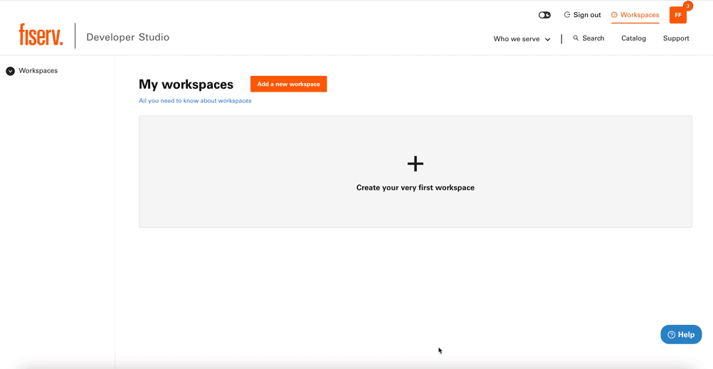
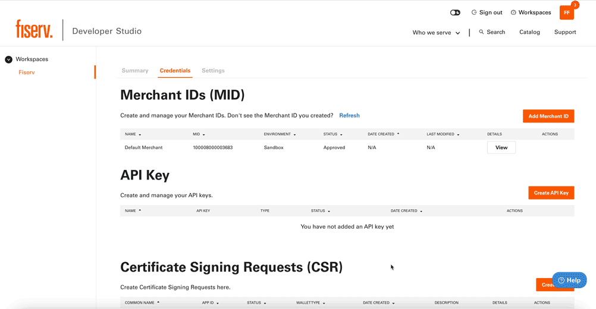

# About Developer Studio

## A centralized portal for Fiserv products

Developer Studio is a developer portal built by Fiserv to bring their financial technology products onto one platform. Within Developer Studio, you can discover APIs, build integrations and test them before launching to market. 

Whether you’re new to product integrations or an experienced developer, we created this guide to help you navigate Developer Studio so you can find exactly what you’re looking for. We designed this guide to be bite size so it’s easy for you to digest and hop around. Feel free go over this guide by clicking on a page on the left side of the screen.

## Workspaces

Expedite your development by managing and keeping track of progress conveniently all on one platform.

## Credential Management

Have full control of your account conveniently with everything right at your fingertips.

## API Experimentation

Boost efficiency in your production by experimenting with APIs to discover exactly what you need.
.gif)

## Guides & Documentation

Develop with confidence with all the right guides and documentations at your disposal.
.gif)

TEST
