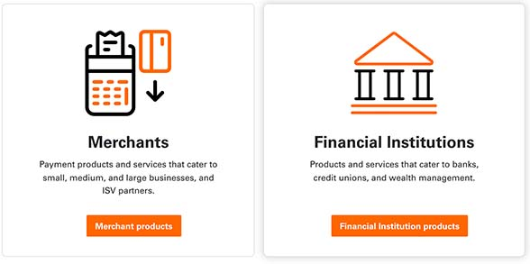

# Explore a product area
## What is a product area?
Product area is the general location you can find products related to your industry.  To figure out which product area is right for you, review the card description and click which one best describes your business. 

  

## Products offered on Developer Studio 
There are many products to choose from and we want to help you figure out which one to integrate. On the left side of the Product Area page, we’ve listed our products by brand name. Some products live in Developer Studio while other products direct you to their external website indicated with the linkout icon. Each product offers APIs that serve different purposes for your business. There are a few ways to help you decide which product is right for you. 

  

## Read use cases to learn about product
If you know what feature you want to integrate but you don’t know the product name, check out our use cases. The top set of cards is the feature you want for your business with a brief description. The feature card highlights below related Fiserv products. The hyperlink takes you to the product’s page where you can learn everything the product can offer to you.

  

## Browse products, features and endpoints 
We categorize the cards as “Product”, “Features”, and “Endpoints”.  You can change the cards by clicking on the categories. “Products” show the cards based on brand name. “Features”show the cards based by similar service. “Endpoints” show the cards by the specific endpoint. 

  

Starting from the top of the card, we listed the product name, the endpoint name with its feature, a description of the endpoint, a hyperlink and (blue-boxed) tags. There are two ways to view the cards: preview and full-display. You can toggle the size by clicking on the icon on the right corner. 

  

You can narrow down the list by using our filtering features. The filter corresponds with the blue-boxed tags in the card so it would only pull up cards based on what you checked on the filter. 

IMAGE
