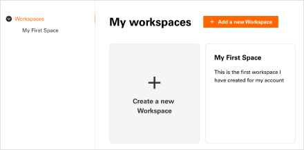
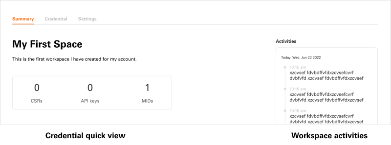
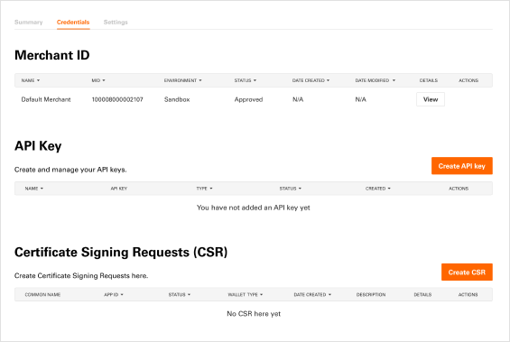
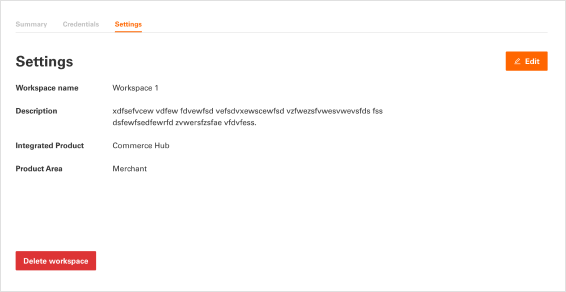
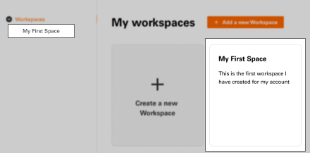

# Workspaces how-to guide (Recipe)

## What are Workspaces

Workspaces are dedicated spaces for developers to manage their Fiserv product integrations and projects. Each workspace may contain a different suite of self-service tools, outlined steps for integration, requirements and sharing permissions as set forth by the specific Fiserv product being integrated against. Developers can create a workspace for any supported Fiserv Product (not all products support workspaces or self-service functionality)

Although each workspace may have different requirements and tools, all workspaces will contain the same set of standard features with a consistent interface as outlined in this how-to guide.

## Getting to My Workspaces

Once logged-in you will see “Workspaces” appear in the global header at the top of the Developer Studio next to your account avatar.

Selecting this will take you to the My Workspaces page. From here you can view all your workspace, select an existing workspace, or create a new one.

## Workspace Pages (Tab Navigation)

All workspaces will display a tab navigation at the top of the screen with the various accessible sections/pages. Each page will contain information and tools to help expedite your development process. Workspace pages may vary based on the specific Fiserv product selected upon during the creation of the workspace.

## Standard Workspace Pages

`Summary Page` – Every workspace will have a Workspace Summary page. This page will display the workspace name and description. The Summary page will provide a quick view of the number of API (Application Programming Interface) keys and other credentials in the workspace. You can also see the latest activity associated with the workspace

`Credentials Page` – Every workspace will have a Credentials page. This page will display a series of tables containing the necessary credentials for a successful integration with the specific Fiserv product. Although every workspace will have a credentials page the types of credentials will vary from product to product. From the credentials page you can create, edit, and manage credentials.

`Settings Page` – Every workspace will have a Settings page. This is where you can see the Fiserv product selected, in addition to the ability to edit the workspace name and description.

`Left Navigation` – Once a workspace has been created, you will see it in a list of all workspaces on the left-hand side of the Workspaces interface. Selecting “workspaces” from the top of this navigation will take you back to the My Workspaces page. On this page you can view all your workspace, select an existing workspace, or create a new one.

## Create & Manage Workspaces

### Create Workspace

1) Create an account or Log-in

2) Select Workspaces from global header (next to account avatar)

3) Create a new workspace

> a. Enter Name

> b. Enter Description

> c. Select Product Area from dropdown (preselected at this time)

> d. Select Product Integration from dropdown (preselected at this time – only CommerceHub is available)

> e. Hit the Create button

### Manage Workspace

1) Create an account or Log-in

2) Select Workspaces from global header (next to account avatar)

3) Select specific workspace from the left navigation or workspace cards

4) View workspace summary

5) Manage Credentials

> a. Click "Credentials" on the tab to go to the Credentials page

> b. View MID details by selecting the View button in MID table

> c. Add/Create API Key by selecting the Create API Key button

>> i. Select MID from dropdown. This will be the MID associated with the API key you are creating.

>> ii. Name the API Key you are creating

>> iii. Select Environment (if available)

>> iv. Add Features (if applicable)

>> v. Hit the Create button
    
>> vi. Download API Key details as a pdf file (this is your one chance to save the API Key details including secret)

&nbsp;&nbsp;&nbsp;&nbsp;&nbsp;&nbsp;d. Add/Create CSR (Certificate Signing Requests) by selecting the Create CSR button

    i. Enter the common name (name your CSR)
    
    ii. Select Apple Pay from wallet dropdown

    iii. Enter Organization Name

    iv. Enter Organization Unit

    v. Select Country/Region from dropdown

    vi. Enter State/Province

    vii. Enter City/Locality

    viii. Enter an optional description

    ix. Hit Create button

  e. View CSR Details by selecting the View button in the CSR table (only available after creating/adding a CSR)

  f. Download CSR and upload to Apple to complete the CSR process for your application

6) Update Settings

a. Hit Edit button

i. Change Workspace Name

ii. Change Workspace Description

b. Delete Workspace by hitting the Delete button
